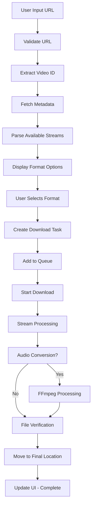

# 📄 TÀI LIỆU ĐẶC TẢ YÊU CẦU PHẦN MỀM (SRS)

## **YouTube Downloader - Ứng dụng Flutter Đa nền tảng**

---

## 1. Giới thiệu

### 1.1 Mục đích

Tài liệu này mô tả đầy đủ các yêu cầu chức năng, phi chức năng và thiết kế tổng quan của một ứng dụng Flutter đa nền tảng cho phép người dùng tải video hoặc audio từ YouTube theo nhiều định dạng và chất lượng khác nhau.

### 1.2 Phạm vi

**Nền tảng hỗ trợ:**

- Android (API level 21+)
- macOS (10.14+)
- Windows (Windows 10+) _(Dự kiến mở rộng trong tương lai)_

**Các chức năng chính:**

- Tải video từ YouTube với độ phân giải tùy chọn (144p đến 8K nếu được hỗ trợ)
- Tải audio từ video YouTube và chuyển đổi sang các định dạng MP3, WAV, FLAC
- Hỗ trợ tải toàn bộ playlist hoặc từng video riêng lẻ
- Hỗ trợ quản lý tiến trình tải với khả năng tạm dừng, tiếp tục và hủy
- Hỗ trợ tải hàng loạt với quản lý hàng đợi
- Tích hợp trích xuất subtitle/phụ đề

### 1.3 Tài liệu tham khảo

- [youtube_explode_dart](https://pub.dev/packages/youtube_explode_dart) - API tương tác YouTube
- [ffmpeg_kit_flutter](https://pub.dev/packages/ffmpeg_kit_flutter) - Xử lý multimedia
- [Flutter Documentation](https://flutter.dev/) - Framework development
- [YouTube Terms of Service](https://www.youtube.com/static?template=terms) - Điều khoản sử dụng

### 1.4 Định nghĩa và từ viết tắt

- **SRS**: Software Requirements Specification
- **UI/UX**: User Interface/User Experience
- **API**: Application Programming Interface
- **FFmpeg**: Framework xử lý multimedia đa nền tảng
- **Stream**: Luồng dữ liệu video/audio
- **Bitrate**: Tốc độ bit (chất lượng audio)

---

## 2. Mô tả tổng quan

### 2.1 Tóm tắt sản phẩm

Ứng dụng YouTube Downloader được phát triển bằng Flutter, cung cấp giải pháp tải video và audio từ YouTube một cách đơn giản, nhanh chóng và hiệu quả. Ứng dụng tập trung vào trải nghiệm người dùng tối ưu với giao diện thân thiện và khả năng tùy chỉnh cao.

### 2.2 Các chức năng hệ thống

ID

Tên chức năng

Ưu tiên

Mô tả chi tiết

F1

Nhập URL video hoặc playlist

Cao

Hỗ trợ nhập/paste URL, validate định dạng, lưu lịch sử

F2

Phân tích video/playlist

Cao

Trích xuất metadata, thumbnails, streams available

F3

Hiển thị lựa chọn định dạng

Cao

UI chọn định dạng với preview chất lượng

F4

Tải video/audio

Cao

Download manager với resume capability

F5

Chuyển đổi định dạng audio

Cao

FFmpeg integration cho audio conversion

F6

Quản lý tiến trình tải

Cao

Real-time progress tracking, queue management

F7

Tải playlist

Trung bình

Batch download với selective choosing

F8

UI thân thiện, đa nền tảng

Cao

Responsive design, theme support

F9

Quản lý file đã tải

Trung bình

History, file organization, quick access

F10

Trích xuất subtitle

Thấp

Download và convert subtitle files

F11

Tùy chỉnh chất lượng nâng cao

Trung bình

Custom bitrate, frame rate options

### 2.3 Đặc điểm người dùng

**Nhóm người dùng chính:**

- **Người dùng phổ thông**: Tải video/music cho mục đích cá nhân
- **Content creators**: Backup nội dung, research
- **Sinh viên/Giảng viên**: Tải tài liệu học tập offline

**Đặc điểm chung:**

- Không yêu cầu đăng nhập hoặc tài khoản
- Không cần kỹ năng kỹ thuật chuyên sâu
- Mong muốn giao diện đơn giản, trực quan
- Ưu tiên tốc độ tải và chất lượng file

### 2.4 Ràng buộc hệ thống

**Ràng buộc kỹ thuật:**

- Flutter SDK >= 3.32.5
- Minimum Android API Level 21 (Android 5.0)
- macOS 10.14 trở lên
- Dung lượng RAM tối thiểu: 2GB
- Dung lượng lưu trữ: 100MB cho app, space cho downloaded content

**Ràng buộc pháp lý:**

- Tuân thủ Terms of Service của YouTube
- Không vi phạm bản quyền nội dung
- Không được phép upload lên official app stores nếu vi phạm policy
- Chỉ sử dụng cho mục đích cá nhân, không thương mại

**Ràng buộc môi trường:**

- Yêu cầu kết nối internet ổn định
- Giới hạn bởi sandbox của Web platform
- Phụ thuộc vào API availability của YouTube

---

## 3. Yêu cầu chức năng chi tiết

### F1 – Nhập URL và Validation

**Mô tả:** Cho phép người dùng nhập/paste URL YouTube và validate tính hợp lệ.

**Input:**

- URL video đơn lẻ: `https://youtube.com/watch?v=VIDEO_ID`
- URL playlist: `https://youtube.com/playlist?list=PLAYLIST_ID`
- URL channel: `https://youtube.com/@CHANNEL_NAME`
- Short URLs: `https://youtu.be/VIDEO_ID`

**Process:**

1.  Detect và normalize URL format
2.  Validate URL structure
3.  Show loading state during analysis
4.  Cache recent URLs for quick access

**Output:**

- Success: Navigate to analysis screen
- Error: Show specific error message với suggestion

**Validation Rules:**

- URL must contain valid YouTube domain
- Video ID format validation
- Network connectivity check
- Region restriction detection

### F2 – Phân tích Video/Playlist

**Mô tả:** Trích xuất thông tin chi tiết từ URL đã nhập.

**Metadata trích xuất:**

- **Video Info**: Title, description, duration, view count, publish date
- **Channel Info**: Channel name, subscriber count, avatar
- **Thumbnail**: Multiple resolutions (120x90 đến 1920x1080)
- **Available Streams**: Video formats, audio formats, quality options
- **Subtitles**: Available languages và format

**Stream Analysis:**

- **Video Streams**: MP4, WebM với các độ phân giải từ 144p đến 8K
- **Audio Streams**: M4A, WebM với bitrate từ 48kbps đến 320kbps
- **Combined Streams**: Video+Audio trong một file

**Error Handling:**

- Private/Deleted video detection
- Age-restricted content handling
- Region-blocked content notification
- Network timeout management

### F3 – Hiển thị Lựa chọn Định dạng

**Mô tả:** Cung cấp giao diện trực quan để chọn format và quality.

**Video Format Selection:**

```
Quality Options:
├── 8K (7680×4320) - WebM/MP4
├── 4K (3840×2160) - WebM/MP4
├── 2K (2560×1440) - WebM/MP4
├── 1080p (1920×1080) - WebM/MP4
├── 720p (1280×720) - WebM/MP4
├── 480p (854×480) - WebM/MP4
├── 360p (640×360) - WebM/MP4
└── 144p (256×144) - WebM/MP4

```

**Audio Format Selection:**

```
Source Formats:
├── M4A (128kbps - 320kbps)
└── WebM (48kbps - 160kbps)

Conversion Options:
├── MP3 (128kbps, 192kbps, 320kbps)
├── WAV (Lossless)
├── FLAC (Lossless compression)
└── AAC (128kbps, 256kbps)

```

**UI Features:**

- File size estimation for each option
- Quality comparison với bitrate info
- Preview thumbnails
- Estimated download time
- Storage space availability check

### F4 – Download Management

**Mô tả:** Hệ thống tải file với khả năng quản lý tiến trình và resume.

**Download Features:**

- **Multi-threading**: Tối đa 4 connections per file
- **Resume capability**: Hỗ trợ resume sau khi bị ngắt
- **Speed optimization**: Dynamic chunk sizing
- **Progress tracking**: Real-time speed, ETA, percentage
- **Queue management**: Multiple downloads với priority system

**File Management:**

- **Auto-naming**: Smart filename generation từ title
- **Duplicate handling**: Version numbering hoặc overwrite option
- **Folder organization**: Auto-create folders by channel/playlist
- **Path selection**: Custom download directory

**States Management:**

```
Download States:
├── Queued - Chờ trong hàng đợi
├── Initializing - Chuẩn bị download
├── Downloading - Đang tải
├── Paused - Tạm dừng
├── Converting - Đang convert (audio)
├── Completed - Hoàn thành
├── Failed - Lỗi
└── Cancelled - Đã hủy

```

### F5 – Audio Conversion với FFmpeg

**Mô tả:** Chuyển đổi audio streams sang các format phổ biến.

**Conversion Pipeline:**

1.  **Download source audio** (M4A/WebM)
2.  **FFmpeg processing** với custom parameters
3.  **Quality optimization** based on source bitrate
4.  **Metadata embedding** (title, artist, thumbnail)
5.  **File cleanup** (remove temporary files)

**Format-specific Settings:**

**MP3 Conversion:**

```bash
ffmpeg -i input.m4a -c:a libmp3lame -b:a 320k -id3v2_version 3 output.mp3

```

**FLAC Conversion:**

```bash
ffmpeg -i input.m4a -c:a flac -compression_level 8 output.flac

```

**WAV Conversion:**

```bash
ffmpeg -i input.m4a -c:a pcm_s16le output.wav

```

**Advanced Features:**

- **Bitrate selection**: User-defined output quality
- **Metadata preservation**: Title, artist, album art
- **Normalization**: Audio level optimization
- **Batch conversion**: Multiple files processing

### F6 – Progress Management & Monitoring

**Mô tả:** Comprehensive tracking system cho tất cả download activities.

**Progress Display Components:**

- **Individual Progress**: Per-file progress bars
- **Overall Progress**: Total completion percentage
- **Speed Monitoring**: Current và average download speed
- **ETA Calculation**: Estimated time remaining
- **Queue Status**: Files pending, active, completed

**Real-time Metrics:**

```
Download Statistics:
├── Current Speed (MB/s)
├── Average Speed (MB/s)
├── Downloaded Size / Total Size
├── Time Elapsed / ETA
├── Active Connections
└── Queue Position

```

**Control Features:**

- **Pause/Resume**: Individual hoặc all downloads
- **Cancel**: Stop với cleanup option
- **Retry**: Auto-retry failed downloads
- **Priority**: Reorder queue items
- **Bandwidth limiting**: Optional speed throttling

### F7 – Playlist Management

**Mô tả:** Comprehensive playlist analysis và batch downloading.

**Playlist Analysis:**

- **Video enumeration**: Full playlist content listing
- **Metadata extraction**: Title, duration, quality info
- **Availability check**: Filter unavailable/private videos
- **Size estimation**: Total download size calculation

**Batch Operations:**

- **Select All/None**: Quick selection controls
- **Custom selection**: Individual video picking
- **Format consistency**: Same format for all selected
- **Parallel downloads**: Configurable concurrent limit

**Playlist Features:**

```
Playlist Operations:
├── Load playlist info
├── Filter videos by criteria
│   ├── Duration (min/max)
│   ├── Quality available
│   ├── Upload date range
│   └── Video title keywords
├── Bulk format selection
├── Sequential/Parallel download
└── Progress aggregation

```

---

## 4. Yêu cầu phi chức năng

### 4.1 Hiệu năng (Performance)

**Response Time Requirements:**

- **URL Analysis**: < 3 giây cho video đơn, < 10 giây cho playlist
- **Download Start**: < 1 giây từ khi nhấn download
- **UI Responsiveness**: < 100ms response time cho user interactions
- **Stream Processing**: Real-time processing không làm giật UI

**Throughput Requirements:**

- **Concurrent Downloads**: Hỗ trợ tối đa 5 downloads đồng thời
- **Download Speed**: Maximize network bandwidth utilization
- **Memory Usage**: < 500MB RAM during normal operation
- **CPU Usage**: < 50% CPU average, < 80% peak

**Implementation Strategies:**

- Sử dụng **Isolates** cho heavy computation tasks
- **Streaming downloads** để giảm memory footprint
- **Connection pooling** cho HTTP requests
- **Lazy loading** cho UI components

### 4.2 Khả năng sử dụng (Usability)

**User Experience Goals:**

- **Learning curve**: Người dùng mới có thể sử dụng trong < 2 phút
- **Error recovery**: Clear error messages với actionable suggestions
- **Accessibility**: Screen reader support, keyboard navigation
- **Internationalization**: Multi-language support (EN, VI, ES, FR)

**Interface Requirements:**

- **Responsive design**: Adaptive layout cho mọi screen size
- **Theme support**: Light/Dark mode với system preference detection
- **Gesture support**: Touch-friendly trên mobile, mouse-friendly trên desktop
- **Visual feedback**: Loading states, progress indicators, success/error animations

### 4.3 Độ tin cậy (Reliability)

**Availability Requirements:**

- **Uptime**: App phải stable, không crash > 99.9% thời gian sử dụng
- **Error handling**: Graceful degradation khi network issues
- **Data integrity**: Download verification với checksum validation
- **Recovery**: Auto-resume downloads sau app restart

**Fault Tolerance:**

- **Network interruption**: Automatic retry với exponential backoff
- **Storage full**: Intelligent error handling và user notification
- **API changes**: Graceful fallback khi YouTube API thay đổi
- **Corrupted downloads**: Detection và re-download capability

### 4.4 Bảo mật (Security)

**Data Protection:**

- **No personal data collection**: App không thu thập thông tin cá nhân
- **Local storage only**: Tất cả data stored locally
- **HTTPS enforcement**: Tất cả network requests qua HTTPS
- **Input validation**: Sanitize user inputs để prevent injection

**Privacy Requirements:**

- **No analytics**: Không gửi usage data ra external services
- **No ads/tracking**: Hoàn toàn ad-free và tracking-free
- **Open source**: Source code công khai để community audit
- **Offline capability**: Core functions work without internet sau khi tải metadata

### 4.5 Khả năng bảo trì (Maintainability)

**Code Quality:**

- **Test coverage**: Minimum 80% code coverage
- **Documentation**: Comprehensive API documentation
- **Code style**: Consistent formatting với linting rules
- **Modular architecture**: Clean separation of concerns

**Extensibility:**

- **Plugin architecture**: Easy integration của new video sources
- **Configuration**: User-configurable settings
- **Theming**: Customizable UI themes
- **Localization**: Easy addition của new languages

### 4.6 Khả năng mở rộng (Scalability)

**Future Expansion:**

- **Additional platforms**: Easy porting sang iOS, Linux, Web
- **New video sources**: Architecture hỗ trợ Vimeo, Dailymotion, etc.
- **Advanced features**: AI-powered content recommendations
- **Cloud integration**: Optional cloud storage backup

**Performance Scaling:**

- **Large playlists**: Handle playlists với 1000+ videos
- **File size**: Support files up to 50GB
- **Concurrent users**: Architecture ready cho multi-user scenarios
- **Resource optimization**: Efficient memory và storage management

---

## 5. Thiết kế giao diện người dùng

### 5.1 Nguyên tắc thiết kế

**Design Principles:**

- **Minimalism**: Clean, uncluttered interface
- **Consistency**: Consistent visual language across platforms
- **Accessibility**: WCAG 2.1 AA compliance
- **Performance**: Smooth animations, responsive interactions

**Visual Hierarchy:**

- Primary actions prominently displayed
- Secondary options easily discoverable
- Consistent spacing và typography
- Clear visual feedback cho user actions

### 5.2 Màn hình chính (Home Screen)

**Layout Components:**

```
┌─────────────────────────────────────┐
│ [App Logo] YouTube Downloader       │
│                              [⚙️🌙] │
├─────────────────────────────────────┤
│                                     │
│ ┌─────────────────────────────────┐ │
│ │ Enter YouTube URL...        [📋]│ │
│ └─────────────────────────────────┘ │
│              [Analyze Video]        │
│                                     │
│ Recent Downloads:                   │
│ ┌─────────────────────────────────┐ │
│ │ [📹] Video Title               │ │
│ │      Channel • Duration • Size  │ │
│ └─────────────────────────────────┘ │
│                                     │
│ Quick Actions:                      │
│ [📁 Folder] [📊 Stats] [❓ Help]    │
└─────────────────────────────────────┘

```

**Features:**

- **Smart URL input**: Auto-detect clipboard content
- **Paste button**: Quick paste từ clipboard
- **Recent history**: Last 10 downloads với quick re-download
- **Quick settings**: Theme toggle, folder selection
- **Help integration**: Contextual help tooltips

### 5.3 Màn hình phân tích (Analysis Screen)

**Video Information Display:**

```
┌─────────────────────────────────────┐
│ ← Back                    [📤 Share]│
├─────────────────────────────────────┤
│ [Thumbnail]  Video Title            │
│              Channel Name           │
│              👁️ 1.2M • ⏱️ 10:30     │
│              📅 2 days ago          │
├─────────────────────────────────────┤
│ Download Options:                   │
│                                     │
│ 🎬 Video Formats:                   │
│ ○ 4K (MP4) • 850MB • Best Quality  │
│ ○ 1080p (MP4) • 250MB • High       │
│ ● 720p (MP4) • 120MB • Recommended │
│ ○ 480p (WebM) • 60MB • Mobile      │
│                                     │
│ 🎵 Audio Only:                      │
│ ○ MP3 320kbps • 12MB               │
│ ○ FLAC • 45MB • Lossless           │
│                                     │
│            [Download Now]           │
└─────────────────────────────────────┘

```

**Interactive Elements:**

- **Format comparison**: Side-by-side quality/size comparison
- **Preview thumbnails**: Multiple thumbnail options
- **Advanced options**: Custom bitrate, frame rate selection
- **Storage check**: Available space warning
- **Download scheduling**: Add to queue vs immediate download

### 5.4 Màn hình Playlist

**Playlist Management Interface:**

```
┌─────────────────────────────────────┐
│ ← Back    Playlist Name    [⚙️ Options]│
├─────────────────────────────────────┤
│ 📊 25 videos • 2.3 GB total         │
│ [✓ Select All] [✗ Clear] [⬇️ Download]│
├─────────────────────────────────────┤
│ ☑️ [Thumb] Video 1 Title            │
│         Channel • 5:30 • 45MB       │
│ ☑️ [Thumb] Video 2 Title            │
│         Channel • 3:15 • 28MB       │
│ ☐ [Thumb] Video 3 Title             │
│         Channel • 8:45 • 67MB       │
│ ...                                 │
├─────────────────────────────────────┤
│ Selected: 15/25 videos • 1.2GB      │
│ Format: MP4 720p • Est: 12 min      │
└─────────────────────────────────────┘

```

**Advanced Features:**

- **Filtering options**: By duration, quality, date
- **Sorting**: Title, duration, date, channel
- **Bulk operations**: Select by criteria
- **Format consistency**: Apply same format to all
- **Smart selection**: Skip unavailable/private videos

### 5.5 Màn hình Downloads (Download Manager)

**Active Downloads View:**

```
┌─────────────────────────────────────┐
│ Downloads                    [⏸️❌📁]│
├─────────────────────────────────────┤
│ Active (2/5):                       │
│                                     │
│ 📹 Video Title 1              85%   │
│ ████████████░░░ 12.5 MB/s • 2 min  │
│ [⏸️] [❌]                           │
│                                     │
│ 🎵 Audio Title 2              45%   │
│ ██████░░░░░░░░░ 8.2 MB/s • 5 min   │
│ [⏸️] [❌]                           │
├─────────────────────────────────────┤
│ Queue (3):                          │
│ • Video Title 3 (MP4 1080p)        │
│ • Video Title 4 (MP3 320kbps)      │
│ • Video Title 5 (WebM 720p)        │
├─────────────────────────────────────┤
│ Completed Today (5):                │
│ ✅ Video Title A • 🗂️ • 🔄         │
│ ✅ Audio Track B • 🗂️ • 🔄         │
└─────────────────────────────────────┘

```

**Control Features:**

- **Global controls**: Pause all, resume all, clear completed
- **Individual controls**: Per-download pause/cancel/retry
- **Queue management**: Drag-and-drop reordering
- **File actions**: Open file, show in folder, re-download
- **Statistics**: Total downloaded, success rate, average speed

### 5.6 Settings Screen

**Configuration Options:**

```
┌─────────────────────────────────────┐
│ ← Settings                          │
├─────────────────────────────────────┤
│ 🎨 Appearance                       │
│   Theme: ○ Light ● Dark ○ System   │
│   Language: English ▼               │
│                                     │
│ 📁 Downloads                        │
│   Default folder: /Downloads ▼      │
│   ☑️ Create subfolders by channel   │
│   ☑️ Auto-clean temp files          │
│                                     │
│ ⚡ Performance                       │
│   Max concurrent: 3 ▼               │
│   Connection timeout: 30s ▼         │
│   ☑️ Resume failed downloads        │
│                                     │
│ 🔊 Audio Conversion                 │
│   Default format: MP3 ▼             │
│   Default bitrate: 320kbps ▼        │
│   ☑️ Embed thumbnails               │
│                                     │
│ ❓ About                            │
│   Version 1.0.0                     │
│   [Check Updates] [Privacy] [Help]  │
└─────────────────────────────────────┘

```

### 5.7 Responsive Design Considerations

**Mobile Layout (Portrait):**

- Single column layout
- Larger touch targets (minimum 44px)
- Simplified navigation với bottom tabs
- Swipe gestures cho common actions

**Tablet Layout:**

- Two-column layout cho content browser
- Side panel cho download queue
- Enhanced multitasking capabilities
- Drag-and-drop support

**Desktop Layout:**

- Multi-pane interface
- Keyboard shortcuts
- Context menus
- Window resizing support
- Menu bar integration

---

## 6. Kiến trúc hệ thống

### 6.1 Tổng quan kiến trúc

**Architectural Pattern: Clean Architecture + MVVM**

```
┌─────────────────────────────────────────┐
│                PRESENTATION             │
│  ┌─────────────┐    ┌─────────────┐     │
│  │   Views     │    │ ViewModels  │     │
│  │ (Widgets)   │◄──►│ (Business   │     │
│  │             │    │  Logic)     │     │
│  └─────────────┘    └─────────────┘     │
└─────────────────┬───────────────────────┘
                  │
┌─────────────────▼───────────────────────┐
│                DOMAIN                   │
│  ┌─────────────┐    ┌─────────────┐     │
│  │ Use Cases   │◄──►│ Entities    │     │
│  │             │    │             │     │
│  └─────────────┘    └─────────────┘     │
│           │               │             │
│  ┌─────────▼─────┐ ┌───────▼─────┐     │
│  │ Repositories  │ │ Interfaces  │     │
│  │ (Interfaces)  │ │             │     │
│  └─────────────────┘ └─────────────┘     │
└─────────────────┬───────────────────────┘
                  │
┌─────────────────▼───────────────────────┐
│                 DATA                    │
│  ┌─────────────┐    ┌─────────────┐     │
│  │Data Sources │    │ Repository  │     │
│  │ (API, Local │◄──►│ Implement.  │     │
│  │  Storage)   │    │             │     │
│  └─────────────┘    └─────────────┘     │
└─────────────────────────────────────────┘

```

### 6.2 Core Components

**Domain Layer - Business Logic:**

```dart
// Entities
class VideoInfo {
  final String id;
  final String title;
  final String description;
  final Duration duration;
  final String channelName;
  final List<VideoStream> videoStreams;
  final List<AudioStream> audioStreams;
  final String thumbnailUrl;
}

class DownloadTask {
  final String id;
  final VideoInfo video;
  final StreamInfo selectedStream;
  final String destinationPath;
  final DownloadStatus status;
  final double progress;
}

// Use Cases
class AnalyzeVideoUseCase {
  Future<VideoInfo> execute(String url);
}

class DownloadVideoUseCase {
  Stream<DownloadProgress> execute(DownloadTask task);
}

```

**Data Layer - External Interfaces:**

```dart
// Repository Interfaces
abstract class VideoRepository {
  Future<VideoInfo> getVideoInfo(String url);
  Future<List<VideoInfo>> getPlaylistVideos(String url);
}

abstract class DownloadRepository {
  Stream<DownloadProgress> downloadVideo(DownloadTask task);
  Future<void> pauseDownload(String taskId);
  Future<void> resumeDownload(String taskId);
}

// Data Sources
class YoutubeDataSource {
  final YoutubeExplode _youtubeExplode;
  Future<VideoInfo> getVideoInfo(String url);
}

class FileDownloadDataSource {
  final Dio _dio;
  Stream<DownloadProgress> downloadFile(String url, String path);
}

```

**Presentation Layer - UI Management:**

```dart
// ViewModels
class VideoAnalysisViewModel extends ChangeNotifier {
  VideoInfo? _videoInfo;
  bool _isLoading = false;
  String? _errorMessage;

  Future<void> analyzeVideo(String url);
  void selectFormat(StreamInfo stream);
  Future<void> startDownload();
}

class DownloadManagerViewModel extends ChangeNotifier {
  List<DownloadTask> _activeTasks = [];
  List<DownloadTask> _completedTasks = [];

  void addDownload(DownloadTask task);
  void pauseDownload(String taskId);
  void cancelDownload(String taskId);
  void retryDownload(String taskId);
}

// Views/Widgets
class VideoAnalysisScreen extends StatelessWidget {
  @override
  Widget build(BuildContext context) {
    return Consumer<VideoAnalysisViewModel>(
      builder: (context, viewModel, child) {
        // UI implementation
      },
    );
  }
}

```

### 6.3 Data Flow Architecture

**Download Process Flow:**



**State Management Flow:**

```dart
// State Management using Provider/Riverpod
class AppState {
  final VideoAnalysisState videoState;
  final DownloadManagerState downloadState;
  final SettingsState settingsState;
  final UIState uiState;
}

// Events/Actions
abstract class AppEvent {}
class AnalyzeVideoEvent extends AppEvent {
  final String url;
}
class StartDownloadEvent extends AppEvent {
  final DownloadTask task;
}
class PauseDownloadEvent extends AppEvent {
  final String taskId;
}

```

### 6.4 External Dependencies Integration

**YouTube API Integration:**

```dart
class YouTubeService {
  final YoutubeExplode _explode;

  Future<Video> getVideo(String url) async {
    try {
      return await _explode.videos.get(url);
    } catch (e) {
      throw VideoNotFoundException('Video not found or private');
    }
  }

  Future<Playlist> getPlaylist(String url) async {
    return await _explode.playlists.get(url);
  }

  Stream<List<Video>> getPlaylistVideos(String playlistId) {
    return _explode.playlists.getVideos(playlistId);
  }
}

```

**FFmpeg Integration:**

```dart
class AudioConverter {
  Future<String> convertToMp3({
    required String inputPath,
    required String outputPath,
    required int bitrate,
  }) async {
    final session = await FFmpegKit.execute(
      '-i "$inputPath" -c:a libmp3lame -b:a ${bitrate}k "$outputPath"'
    );

    final returnCode = await session.getReturnCode();
    if (ReturnCode.isSuccess(returnCode)) {
      return outputPath;
    } else {
      throw ConversionException('Failed to convert audio');
    }
  }
}

```

### 6.5 Database Schema

**Local Storage Schema (SQLite):**

```sql
-- Download History
CREATE TABLE download_history (
    id TEXT PRIMARY KEY,
    video_id TEXT NOT NULL,
    title TEXT NOT NULL,
    channel_name TEXT,
    duration INTEGER,
    file_path TEXT NOT NULL,
    file_size INTEGER,
    format TEXT NOT NULL,
    quality TEXT,
    download_date INTEGER NOT NULL,
    status TEXT DEFAULT 'completed'
);

-- Download Queue
CREATE TABLE download_queue (
    id TEXT PRIMARY KEY,
    video_info TEXT NOT NULL, -- JSON
    selected_stream TEXT NOT NULL, -- JSON
    destination_path TEXT NOT NULL,
    priority INTEGER DEFAULT 0,
    created_date INTEGER NOT NULL,
    status TEXT DEFAULT 'queued'
);

-- User Preferences
CREATE TABLE user_preferences (
    key TEXT PRIMARY KEY,
    value TEXT NOT NULL
);

-- Download Progress (In-memory/Temp)
CREATE TEMP TABLE download_progress (
    task_id TEXT PRIMARY KEY,
    progress REAL DEFAULT 0.0,
    speed REAL DEFAULT 0.0,
    eta INTEGER DEFAULT 0,
    status TEXT DEFAULT 'initializing'
);

```

---

## 7. Công nghệ & Thư viện

### 7.1 Technology Stack

**Core Framework:**

- **Flutter SDK**: >= 3.32.5
- **Dart**: >= 3.8.1
- **Target Platforms**: Android API 21+, macOS 10.14+

**Essential Dependencies:**

```yaml
dependencies:
  flutter:
    sdk: flutter

  # YouTube API
  youtube_explode_dart: ^2.5.1

  # HTTP & Downloads
  dio: ^5.8.0+1

  # Media Processing
  ffmpeg_kit_flutter_new: ^2.0.0

  # File System
  path_provider: ^2.1.5
  permission_handler: ^12.0.1
  file_picker: ^10.2.0

  # Database
  sqflite: ^2.4.2
  flutter_bloc: ^9.1.1

dev_dependencies:
  flutter_test:
    sdk: flutter
  flutter_lints: ^3.0.0
  mockito: ^5.4.2
  integration_test:
    sdk: flutter
```

---

## 12. Phụ lục

### 12.1 Định dạng hỗ trợ chi tiết

**Video Formats:**

Định dạng

Container

Video Codec

Audio Codec

Chất lượng

Ghi chú

MP4

MP4

H.264

AAC

144p-8K

Phổ biến nhất

WebM

WebM

VP9

Opus

144p-8K

Google format

WebM

WebM

AV1

Opus

1080p-8K

Mới nhất, nén tốt

**Audio Formats:**

Định dạng

Bitrate

Lossy/Lossless

Compatibility

File Size

MP3

128-320 kbps

Lossy

Universal

Small

M4A

128-256 kbps

Lossy

Apple/Modern

Medium

FLAC

Variable

Lossless

Most players

Large

WAV

1411 kbps

Lossless

Universal

Very Large

Opus

48-320 kbps

Lossy

Modern only

Small

### 12.2 Performance Benchmarks

**Target Performance Metrics:**

Metric

Target

Measurement Method

App Launch

< 2 seconds

Cold start to UI ready

URL Analysis

< 5 seconds

Input to results display

Download Start

< 1 second

Button tap to transfer begin

Memory Usage

< 512 MB

Peak during heavy operation

CPU Usage

< 60%

Average during download

Battery Impact

Minimal

Background optimization

### 12.3 Compatibility Matrix

**Platform Support:**

Platform

Minimum Version

Recommended

Status

Android

API 21 (5.0)

API 30+

✅ Supported

macOS

10.14

12.0+

✅ Supported

Windows

Windows 10

Windows 11

🔄 Planned

iOS

iOS 12

iOS 15+

❌ Legal restrictions

Linux

Ubuntu 18.04

Ubuntu 22+

🔄 Community request

Web

N/A

N/A

❌ Technical limitations

### 12.4 Third-party Licenses

**Open Source Dependencies:**

```
youtube_explode_dart - BSD-3-Clause
ffmpeg_kit_flutter - LGPL v3.0
dio - MIT License
provider - MIT License
sqflite - MIT License
path_provider - BSD-3-Clause
permission_handler - MIT License

```

### 12.5 Glossary

**Technical Terms:**

- **Bitrate**: Số bit dữ liệu được xử lý trong một đơn vị thời gian, ảnh hưởng đến chất lượng
- **Codec**: Thuật toán nén/giải nén dữ liệu multimedia
- **Container**: Format file chứa video/audio streams (MP4, WebM, etc.)
- **Lossless**: Nén không mất dữ liệu, chất lượng gốc được bảo toàn
- **Lossy**: Nén có mất dữ liệu để giảm kích thước file
- **Stream**: Luồng dữ liệu video hoặc audio riêng biệt
- **Transcoding**: Chuyển đổi từ format này sang format khác

**Business Terms:**

- **ToS**: Terms of Service - Điều khoản sử dụng
- **DMCA**: Digital Millennium Copyright Act - Luật bản quyền số
- **Fair Use**: Sử dụng hợp lý theo quy định bản quyền
- **API Rate Limiting**: Giới hạn số lượng requests per time period

---
